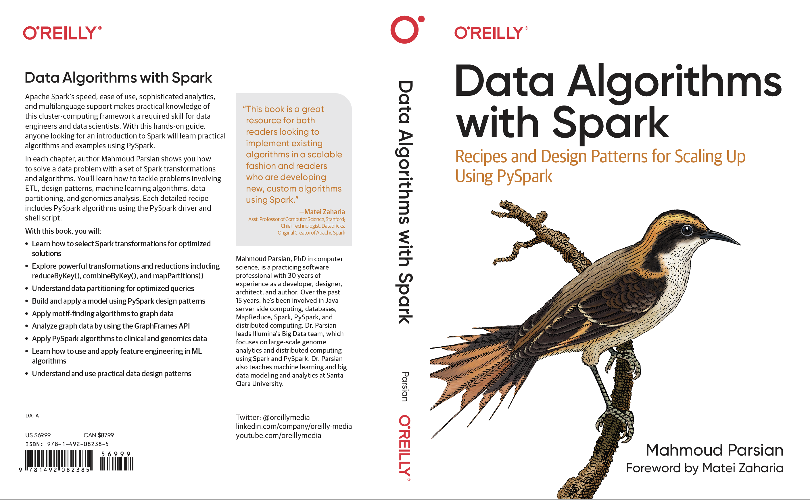

# [Data Algorithms with Spark](https://www.oreilly.com/library/view/data-algorithms-with/9781492082378/)
### by [Mahmoud Parsian](https://www.linkedin.com/in/mahmoudparsian/)

<table>
<tr>
<td width="180">

</td>
<td>

> "... This book will be a great resource for both readers looking to
> implement existing algorithms in a scalable fashion and readers who
> are developing new, custom algorithms using Spark. ..."
>
> — [Dr. Matei Zaharia](https://people.eecs.berkeley.edu/~matei/), Original Creator of Apache Spark

[Read the full Foreword by Dr. Matei Zaharia](./docs/FOREWORD_by_Dr_Matei_Zaharia.md)

</td>
</tr>
</table>

* [Goal of this book](./docs/goal_of_book.md)
* [Story of this book](./docs/story_of_book.md)

-------

## About the Book

* This [O'Reilly book](https://www.oreilly.com/library/view/data-algorithms-with/9781492082378/)
  is the successor edition to [*Data Algorithms*](https://www.oreilly.com/library/view/data-algorithms/9781491906170/),
  also published by O'Reilly.
* It uses PySpark throughout — much simpler and more readable than the Java/Scala of the original edition.
* Published: [April 8, 2022](https://www.oreilly.com/library/view/data-algorithms-with/9781492082378/)
* Announcement: [@OReillyMedia on Twitter](https://twitter.com/OReillyMedia/status/1511796122548903938/)

## Author

**Mahmoud Parsian**

-------

## [GitHub Chapter Solutions](./code/)

This repository hosts all source code and scripts for
[Data Algorithms with Spark](https://www.oreilly.com/library/view/data-algorithms-with/9781492082378/).

Chapter solutions are provided in [PySpark and Scala](./code/):
* [PySpark solutions](./code/) by [Mahmoud Parsian](https://github.com/mahmoudparsian/)
* [Scala solutions](./code/) by [Deepak Kumar](https://github.com/deepakmca05/) and [Biman Mandal](https://github.com/bimanmandal/)

## Software

All programs are tested with the following software:

| Spark    |      Python      |  Scala | Java |
|----------|:----------------:|-------:|-----:|
| [Apache Spark 3.4.0](http://spark.apache.org/downloads.html) |  [Python 3.10.5](https://www.python.org/downloads/) | [Scala 2.13](https://www.scala-lang.org/download/scala2.html) | [Java 11](https://www.oracle.com/java/technologies/javase/jdk11-archive-downloads.html) |

-----

## Table of Contents

| Chapter      |      Title       |
|--------------|------------------|
| Glossary     | [Glossary of Big Data, MapReduce, Spark](https://github.com/mahmoudparsian/big-data-mapreduce-course/blob/master/slides/glossary/glossary_of_big_data_and_mapreduce.md) |
| Chapter 1    | [Introduction to Data Algorithms](./code/chap01/) |
| Chapter 2    | [Transformations in Action](./code/chap02/) |
| Chapter 3    | [Mapper Transformations](./code/chap03/) |
| Chapter 4    | [Reductions in Spark](./code/chap04/) |
| Chapter 5    | [Partitioning Data](./code/chap05/) |
| Chapter 6    | [Graph Algorithms](./code/chap06/) |
| Chapter 7    | [Interacting with External Data Sources](./code/chap07/) |
| Chapter 8    | [Ranking Algorithms](./code/chap08/) |
| Chapter 9    | [Fundamental Data Design Patterns](./code/chap09/) |
| Chapter 10   | [Common Data Design Patterns](./code/chap10/) |
| Chapter 11   | [Join Design Patterns](./code/chap11/) |
| Chapter 12   | [Feature Engineering in PySpark](./code/chap12/) |

--------

## Bonus Chapters

| Bonus Chapter                     | Title / Description  |
|------------------------------------|-----------------------|
| Glossary                          | [Glossary of Big Data, MapReduce, Spark](https://github.com/mahmoudparsian/big-data-mapreduce-course/blob/master/slides/glossary/glossary_of_big_data_and_mapreduce.md) |
| Word Count                        | [Solutions for Word Count using RDDs and DataFrames](./code/bonus_chapters/wordcount/) |
| Anagrams                          | [Find words which are anagrams](./code/bonus_chapters/anagrams/) |
| Lambda Expressions                | [Using Lambda Expressions in PySpark programs](./code/bonus_chapters/lambda_expressions/) |
| TF-IDF                            | [Term Frequency - Inverse Document Frequency](./code/bonus_chapters/TF-IDF/) |
| K-mers                            | [K-mers for DNA Sequences](./code/bonus_chapters/k-mers/) |
| Correlation                       | [All vs. All Correlation](./code/bonus_chapters/correlation/) |
| Mapping Partitions                | [`mapPartitions()` Complete Example](./code/bonus_chapters/mappartitions/) |
| UDF                               | [User-Defined Function Examples](./code/bonus_chapters/UDF/) |
| DataFrames Transformations        | [Examples on Creation and Transformation of DataFrames](./code/bonus_chapters/dataframes/) |
| DataFrames Tutorials              | [DataFrames Tutorials: from collections and CSV text files](./code/bonus_chapters/dataframes/) |
| Join Operations                   | [Examples on join of RDDs and DataFrames](./code/bonus_chapters/join/) |
| PySpark Tutorial 101              | [Examples on using PySpark RDDs and DataFrames](./code/bonus_chapters/pyspark_tutorial/) |
| Physical Data Partitioning        | [Tutorial of Physical Data Partitioning](./code/bonus_chapters/physical_partitioning/README.md) |
| Monoids and Combiners             | [Monoid as a Design Principle](https://github.com/mahmoudparsian/data-algorithms-with-spark/blob/master/wiki-spark/docs/monoid/README.md) |

-------

------

<!---      metadata         -->
<!---   Data Algorithms with Spark, Spark, PySpark, Python -->
<!---   MapReduce, Distributed Algorithms, mappers, reducers, partitioners -->
<!---   Transformations, Actions, RDDs, DataFrames, SQL -->
<!---   Data Design Patterns, monoids -->
<!---   RDD map transformations: map(), flatMap(), mapPartitions() -->
<!---   RDD reducers: groupByKey(), reduceByKey(), combineByKey() -->
<!---   RDD actions: reduce(), collect()  -->
<!---   RDD Tutorial -->
<!---   DataFrame Tutorial -->
<!---   Join operations -->
<!---   RDD reducers -->
<!---   DataFrames creation, manipulation, and transformations -->

-------
