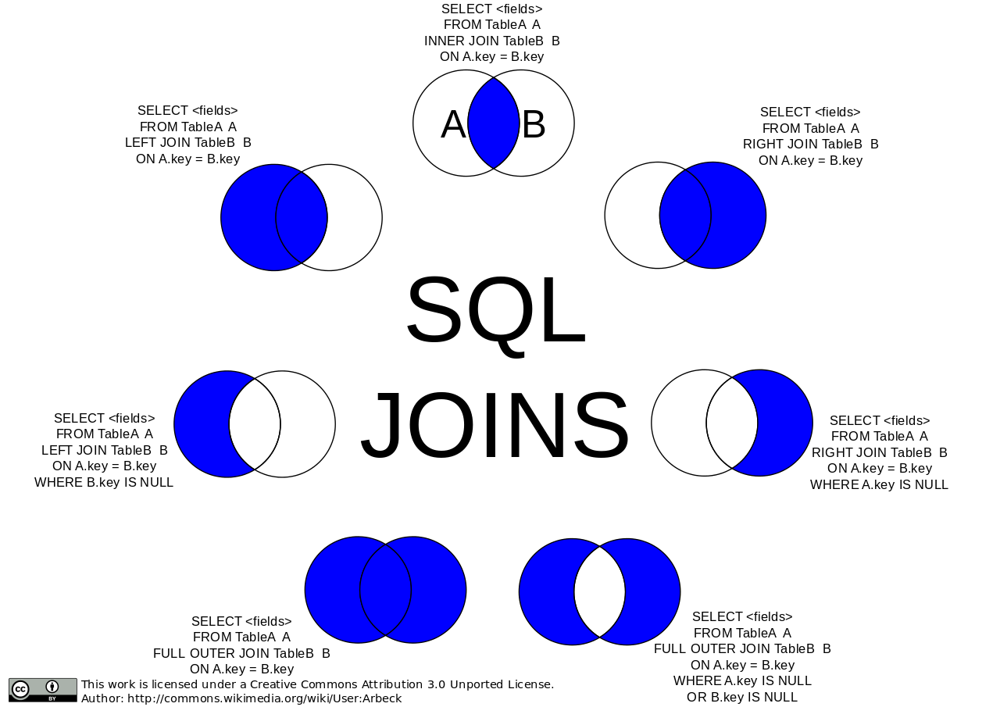

# Join operation

------

* In a nutshell, a join is an SQL operation performed 
to establish a connection between two (or more) database 
tables based on matching columns, thereby creating a 
relationship between the tables. 

* Types of joins
	* Cross join. A cross join returns all possible combinations 
	  of rows of two tables (also called a Cartesian product).

	* Join/inner join. An inner join, also known as a simple join, 
	  returns rows from joined tables that have matching rows. 

	* Left outer join/left join.

	* Right outer join/right join.

	* Full outer join.

-----------

