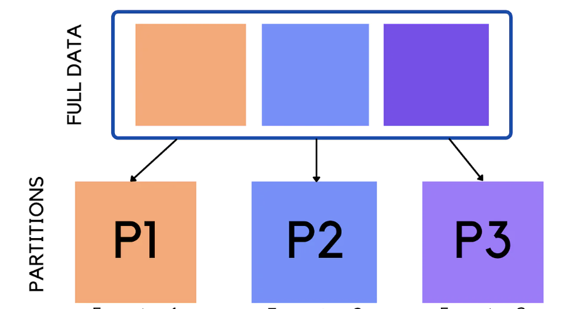

# Physical Data Partitioning
# Analyze Alice of Data rather than Whole Data

-------

	Author: Mahmoud Parsian
	Last revised date: July 26, 2022

--------

<table>
<tr>

<td>

</td>

<td>
"... This  book  will be a  great resource for  
both readers looking  to  implement  existing  
algorithms in a scalable fashion and readers  
who are developing new, custom algorithms   
using Spark. ..."  
 
<a href="https://cs.stanford.edu/people/matei/">Dr. Matei Zaharia</a> 
Original Creator of Apache Spark  
 
<a href="https://github.com/mahmoudparsian/data-algorithms-with-spark/blob/master/docs/FOREWORD_by_Dr_Matei_Zaharia.md">FOREWORD by Dr. Matei Zaharia</a> 
</td>

</tr>   
</table>

--------

## Physical Data Partitioning Example

	<root-data-dir>/continents/continent=asia/...
	<root-data-dir>/continents/continent=africa/...
	<root-data-dir>/continents/continent=europe/...
	<root-data-dir>/continents/continent=oceania/...
	<root-data-dir>/continents/continent=antarctica/...
	<root-data-dir>/continents/continent=north_america/...
	<root-data-dir>/continents/continent=south_america/...

--------
	
## What is Physical Partitioning 

Physical Partitioning is a technique, which 
partitions data (expressed as a Spark DataFrame) 
based on one or more columns.  These columns are 
called partitioned columns, which will appear in 
your SQL queries `WHERE` clause. The main goal of 
partitioning data is to analyze (by using SQL with 
`WHERE` clause) slice of a data rather than the 
whole data.

By partitioning your data, you can restrict the 
amount of data scanned by each SQL query, thus 
improving performance and reducing cost. You can 
partition your data by any key (can be one or more 
columns of your data expressed as a DataFrame). A 
common practice is to partition the data based on 
time, often leading to a multi-level partitioning 
scheme. For example, a customer who has data coming 
in every hour might decide to partition by year, 
month, date, and hour. Another customer, who has data 
coming from many different sources but that is loaded 
only once per day, might partition by a data source 
identifier and date.

To understand Physical Data Partitioning, I am going 
to provide another simple example: let's say that your
data (world temperature data) has the following format:

		<continent><,><country><,><city><,><temperature>

Example of some data records are provided:

	continent,country,city,temperature
	Africa,Algeria,Oran,71
	Africa,Algeria,Oran,74
	Africa,Algeria,Oran,64
	Africa,Algeria,Banta,81
	Africa,Algeria,Banta,64
	... 

It is very easy to create a Spark DataFrame from this 
data and then partition it by (`continent`), (`continent`, 
`country`), or  (`continent`, `country`, `city`). For 
example if our intention is to have a `WHERE` clause 
to include `continent` and `country`, then we can partition
our data by two columns:  (`continent`, `country`).

For example, Amazon Athena uses Apache Hive style partitions, 
whose data paths contain key value pairs connected by equal 
signs. Some examples are provided:

	<root-directory>/continent=NorthAmerica/country=USA/...
	<root-directory>/continent=NorthAmerica/country=Canada/...
	<root-directory>/continent=Africa/country=Algeria/...
	...
	
For example, sample SQL query will be:

	SELECT avg(temperature) 
		FROM <table-name-defined-by-you>
			WHERE continent = 'NorthAmerica' AND
				country = 'Canada'
			
This SQL query will analze only one directory (rather
than all directories):

	<root-directory>/continent=NorthAmerica/country=Canada/...

	
Thus, the physical directory paths include both the 
names of the partition keys and the values that each 
path represents. For example, in Amazon Athena, to 
load new Hive partitions into a partitioned table, you 
can use the `MSCK REPAIR TABLE` command, which works 
only with Hive-style partitions. Amazon Athena can 
also use non-Hive style partitioning schemes. For 
details, visit [Amazon Athena Users 
Guide](https://docs.aws.amazon.com/athena/latest/ug/athena-ug.pdf). 

Amazon Athena, Google BigQuery, and Snowflake use this 
simple data partitioning technique to analyze slice of 
a data rather than whole data.

## Sample Input

Sample data is given [here](./continents_countries_temp.csv).

Our sample data has the following format:

		<continent><,><country><,><city><,><temperature>

## Physical Partitioning in PySpark

PySpark make it easy to partition data by desired columns
and save data in Parquet or other formats. Parquet is 
ideal for SQL queries since data is stored in columnar 
format.

To partition data by your desired column(s), we need the
perform the following steps:

**Step-1**. Create a DataFrame (denoted by `df`) as `n` columns
(where `n > 0`):

		DataFrame(C_1, C_2, C_3, ..., C_n)

Sample code to create your DataFrame and denote it as `df`:

	# create an instance of a SparkSession object 
	from pyspark.sql import SparkSession 
	spark = SparkSession.builder.getOrCreate() 
 
	# define your input in S3 
	input_path= 's3://mybucket/INPUT/continents_countries_temp.csv’ 
 
	# create a DataFrame from your input path 
	df = spark.read.format("csv")\ 
		.option("header","true")\ 
		.option("inferSchema", "true")\ 
		.load(input_path) 

**Step-2**: Assume that `C_i` is your partitioned column 
name (where `i` in `{1, 2, ..., n}`

This means that your intention is to use the following 
in your SQL query (note that `<table-name-defined-by-you>`
will point to the `output_path` defined below):

		SELECT ...
			FROM <table-name-defined-by-you>
				WHERE C_i = 'some-desired-value'

Note that the above SQL query will only analyze one 
partitioned data directory (listed below): this is 
how we **analyze slice of a data rather than the whole data**:

		<root-output-path-directory>/C_i=some-desired-value/...

**Step-3**: Define the root directory (or your output path) for
your partitioned data:

		output_path = "s3://<bucket-name>/<directory-name>/"
		
**Step-4**: Partition and save your DataFrame (denoted by `df`): 

General code snippet is given below:

	# define output path in S3 
	output_path = "s3://<bucket-name>/<directory-name>/"
 
	# partition by C_i and save into output path 
	df.repartition("C_i")\ 
		.write.mode("append")\ 
		.partitionBy("C_i")\ 
		.parquet(output_path)

A complete example using our temperature data is given 
below (here it is assumed that we want to partition data
by `continent`)

	# define output path in S3 
	output_path = "s3://mybucket/OUTPUT/continents/" 
 
	# partition by continent and save into S3 
	df.repartition("continent")\
	  .write.mode("append")\
	  .partitionBy("continent")\
	  .parquet(output_path)
	   
	# NOTE: 
	#     There will be a separate folder 
	#     under `output_path` per continent 
	# END-NOTE

For our temperature data, the created folders and data 
will be as (note that since I used `repartition("continent")`
then there will be one Parquet file per continent):

	
	s3://mybucket/OUTPUT/continents/continent=asia/part1.parquet
	s3://mybucket/OUTPUT/continents/continent=africa/part1.parquet
	s3://mybucket/OUTPUT/continents/continent=europe/part1.parquet
	s3://mybucket/OUTPUT/continents/continent=oceania/part1.parquet
	s3://mybucket/OUTPUT/continents/continent=antarctica/part1.parquet
	s3://mybucket/OUTPUT/continents/continent=north_america/part1.parquet
	s3://mybucket/OUTPUT/continents/continent=south_america/part1.parquet
	
	

## Creating Table Schema

Now that we have successfully partitioned our data, 
it is time to create a table which points to our 
output path (partitioned saved data)(here we have 
assumed that the  `continent` is the partitioned 
column):

	CREATE EXTERNAL TABLE `continents`( 
	   `country` string, 
	   `city` string, 
	   `temperature` integer 
	) 
	PARTITIONED BY ( 
	   `continent` string 
	)
	STORED AS PARQUET 
	LOCATION ‘s3://mybucket/OUTPUT/continents/’ 
	tblproperties ("parquet.compress"="SNAPPY"); 
	

## Loading Partitions

In Amazon Athena, to load partitons (so that the table
will know what partitions are available), we need to 
excute the following command:

General format

	MSCK REPAIR TABLE <table-name>;
	
Example:

	MSCK REPAIR TABLE continents;
	
The `MSCK REPAIR TABLE` command will load all partitions 
for the `continents` table (without executing this command,
your SQL queries will return null/empty results). 
 
MSCK = metastore consistency check 

## Query your data by SQL
Now, we can use SQL queries to access data pointed by our
`output_path` and enabled by the `continents` table:

	SELECT avg(temprature)
		FROM continents
			WHERE continent ' = 'Asia'
			
Partitioning enable us to analyze/scan slice of data (denoted by
`s3://mybucket/OUTPUT/continents/continent=Asia/...`) rather
than scanning the whole data: this will faster and cheaper.

## Directory Listing

 Filename                             | Description
------------------------------------- | -------------
`README.md`                           | This file you are reading
`continents_countries_temp.csv`       | Sample data in CSV format
`partition_by_one_column.py`          | Partition data by a single column
`partition_by_one_column_schema.sql`  | Table schema for data partitioned by a single column
`partition_by_two_columns.py`         | Partition data by two columns
`partition_by_two_columns_schema.sql` | Table schema for data partitioned by two columns

--------

## References

1. [Top 10 Performance Tuning Tips for Amazon Athena](https://aws.amazon.com/blogs/big-data/top-10-performance-tuning-tips-for-amazon-athena/)  

2. [Data Algorithms with Spark, Chapter 5](https://www.oreilly.com/library/view/data-algorithms-with/9781492082378/)

3. [Partitioning on Disk with `partitionBy`](https://mungingdata.com/apache-spark/partitionby/)

--------

<a href="https://www.oreilly.com/library/view/data-algorithms-with/9781492082378/">
    

<a href="https://www.oreilly.com/library/view/data-algorithms-with/9781492082378/">
    

------

[//]: # (metadata:)
[//]: # (Data Algorithms with Spark, Spark, PySpark, Python)
[//]: # (MapReduce, Distributed Algorithms, mappers, reducers, partitioners)
[//]: # (Transformations, Actions, RDDs, DataFrames, SQL)
[//]: # (Data Design Patterns, monoids)
