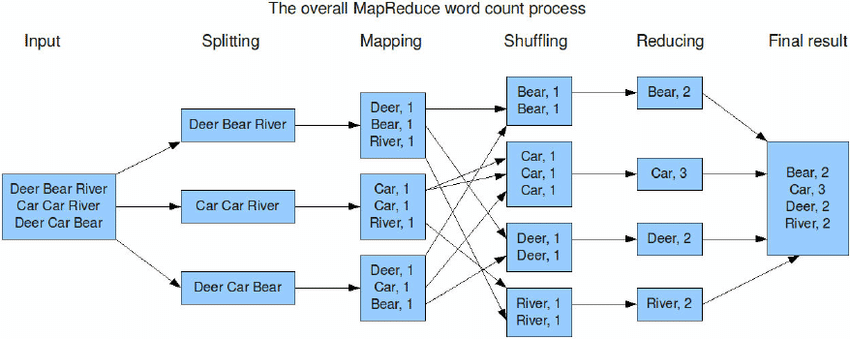

# Word Count

--------

<table>
<tr>

<td>

</td>

<td>
"... This  book  will be a  great resource for  
both readers looking  to  implement  existing  
algorithms in a scalable fashion and readers  
who are developing new, custom algorithms   
using Spark. ..."  
 
<a href="https://cs.stanford.edu/people/matei/">Dr. Matei Zaharia</a> 
Original Creator of Apache Spark  
 
<a href="https://github.com/mahmoudparsian/data-algorithms-with-spark/blob/master/docs/FOREWORD_by_Dr_Matei_Zaharia.md">FOREWORD by Dr. Matei Zaharia</a> 
</td>

</tr>   
</table>

---------
## Introduction to Word Count

* Word Count is a simple and easy to understand 
  algorithm which can be easily implemented as 
  a MapReduce/Spark application. Given a set of 
  text documents, the program counts the number 
  of occurrences of each word.

* Word count finds out the frequency of each 
  word in a set of documents/files. The goal 
  is to create a dictionary of `(key, value)` 
  pairs, where `key` is a word (as a String), 
  and `value` is an Integer denoting the 
  frequency of a given key/word.

* Complete set of solutions are given for Word Count problem using 
	* [Word Count in PySpark DataFrames](./python/)
	* [Word Count in PySpark RDD: `groupByKey()`](./python/)
	* [Word Count in PySpark RDD: `reduceByKey()`](./python/)

* **BEFORE reduction filter**: 
  You may add `filter()` to remove undesired words
  (this can be done after tokenizing records)

* **AFTER reduction filter**:
  To have a desired final word count as 
  `(word, frequency)`, you may add `filter()` 
  to remove elements where `frequency < N `, 
  where `N` (as an integer) is your threshold.
  This can be done after reduction.
  
--------

## Word Count in MapReduce

---------

## [Word Count in PySpark RDDs](./python/)

--------

## [Word Count in PySpark DataFrames](./python/)

-------

## References

[1. Word count from Wiki](https://en.wikipedia.org/wiki/Word_count)

[2. Word Count Example, Spark](https://spark.apache.org/examples.html)