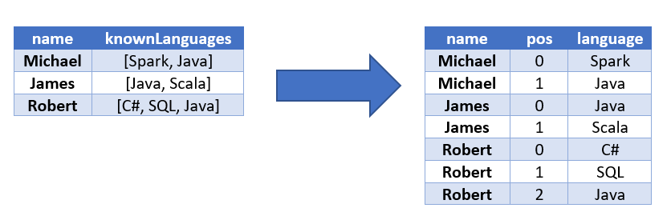

# `explode()`

The `pyspark.sql.functions.explode` returns a new 
row for each element in the given array or map. 
Uses the default column name `col` for elements in 
the array and `key` and `value` for elements in the 
map unless specified otherwise.

In the following example note that the 
following rows/entries 

	(name = "dave", languages = [])
	(name = "ted", languages = [])

are dropped from the result of the `explode()` function
since `languages` is an empty list.

~~~python
>>> spark.version
'3.3.2'

>>> some_rows = [("alex", ["Java", "Python", "SQL"]), 
                 ("dave", []),
                 ("jane", ["C++", "COBOL"]), 
                 ("mary", ["FORTRAN"]), 
                 ("ted", []) ]

>>> column_names = ["name", "languages"]
>>> df = spark.createDataFrame(some_rows, column_names)
>>> df.printSchema()
root
 |-- name: string (nullable = true)
 |-- languages: array (nullable = true)
 |    |-- element: string (containsNull = true)

>>> df.show(truncate=False)
+----+-------------------+
|name|languages          |
+----+-------------------+
|alex|[Java, Python, SQL]|
|dave|[]                 |
|jane|[C++, COBOL]       |
|mary|[FORTRAN]          |
|ted |[]                 |
+----+-------------------+

>>> from pyspark.sql.functions import explode
>>> df2 = df.select(df.name,explode(df.languages))
>>> df2.printSchema()
root
 |-- name: string (nullable = true)
 |-- col: string (nullable = true)

>>> df2.show(truncate=False)
+----+-------+
|name|col    |
+----+-------+
|alex|Java   |
|alex|Python |
|alex|SQL    |
|jane|C++    |
|jane|COBOL  |
|mary|FORTRAN|
+----+-------+

~~~