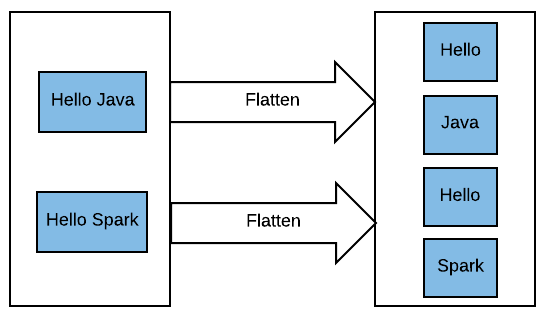

# `RDD.flatMap()`

The `RDD.flatMap(f)` returns a new RDD by first applying 
a function `f()` to all elements of this RDD, and then 
flattening the results.

In the following example note that the empty elements are 
dropped. 

~~~python
>>> spark.version
'3.3.2'

>>> some_elements = [["e0", "e1", "e2", "e3"], 
                     [], 
                     ["e4", "e5"], 
                     ["e6"], 
                     [] ]
>>> len(some_elements)
5
>>> rdd = spark.sparkContext.parallelize(some_elements)
>>> rdd.collect()
[ ['e0', 'e1', 'e2', 'e3'], [], ['e4', 'e5'], ['e6'], [] ]

>>> mapped = rdd.map(lambda x: x)
>>> mapped.collect()
[ ['e0', 'e1', 'e2', 'e3'], [], ['e4', 'e5'], ['e6'], [] ]
>>> mapped.count()
5

>>> flat_mapped = rdd.flatMap(lambda x: x)
>>> flat_mapped.collect()
['e0', 'e1', 'e2', 'e3', 'e4', 'e5', 'e6']
>>> flat_mapped.count()
7
~~~