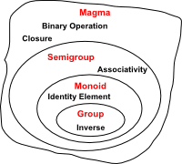

# Monoid: Design Principle

	Author: Mahmoud Parsian
	Last updated: 1/1/2023

## 1. Introduction

In this article, I will define a **monoid** 
and show that how it can help us to write 
better and correct reducers in MapReduce 
and Spark environments.  In abstract algebra
(study of algebraic structures), a branch of 
mathematics, a **monoid** is a set 
equipped with an associative binary 
operation and an identity element
(will be discussed shortly).

Understanding monoids can help us to 
write  semantically  correct reducers 
in MapReduce (`reduce()` and `combine()`)
and Spark (`reduceByKey()` transformation). 
Before defining what a monoid 
is, I will present some of the basic 
properties of binary functions.

## 2. What is an Associative Law
An associative operation:

		f: X x X -> X

is a binary operation such that for all `a, b, c` in `X`:

		f(a, f(b, c)) = f(f(a, b), c)

For example, `+` (addition) is an associative function because 

		(a + (b + c)) = ((a + b) + c)

For example, `*` (multiplication) is an associative function because 

		(a * (b * c)) = ((a * b) * c)

While, `-` (subtraction) is not an associative function because

		(4 - (6 - 3) != ((4 - 6) - 3)
		     (4 - 3) != (-2 - 3)
		           1 != -5

While average operation (denoted by `avg`) is not an associative function.

	FACT: avg(1, 2, 3) = 2
	
    avg(1, avg(2, 3)) != avg(avg(1, 2), 3)
          avg(1, 2.5) != avg(1.5, 3)
                 1.75 != 2.25

## 3. What is a Commutative Law
A commutative function `f` is a function that takes 
multiple inputs from a set `X` and produces an output 
that does not depend on the ordering of the inputs. 

For example, the binary operation `+` is commutative, 
because `2 + 5 = 5 + 2 = 7`.

For example, the binary operation `*` is commutative, 
because `2 * 5 = 5 * 2 = 10`.

Function `f` is commutative if the following property holds:

    f(a, b) = f(b, a)

While, `-` (subtraction) is not an commutative function because

    2 - 4 != 4 - 2
       -2 != 2

While, `/` (division) is not an commutative function because

     2 / 4 != 4 / 2
       0.5 != 2

## 4. Semigroup

A semigroup is a set `S` together with a binary operation `f`:

	f: S x S -> S
	
that satisfies the associative property: for all `a, b, c in S`:

		f(a, f(b, c)) = f(f(a, b), c)

Semigroup examples:

* The set of positive integers with addition (with 0 included, 
this becomes a monoid.)

* The set of integers with minimum or maximum (with positive/negative 
infinity included, this becomes a monoid.)

## 5. Monoid

Monoids are algebraic structures. 
A monoid M is a triplet `(X, f, i)`, where 

* `X` is a set
* `f` is an associative binary operator
* `i` is an identity element in `X` and it is **unique** 

The monoid axioms (which govern the behavior of `f`) are as follows.

1. (Closure) For all `a, b in X`,  `f(a, b)` 
   and `f(b, a)` is also in `X`.

2. (Associativity) For all `a, b, c in X`:

		f(a, f(b, c)) = f(f(a, b), c)

3. (Identity) There is an `i` (called an **identity element**,
   which is unique)  in `X` such that, for all `a` in `X`:

		f(a, i) = a
		f(i, a) = a

There is an alternative way to define a monoid: a monoid is a 
***semigroup** with a certain element called an **identity element**
(denoted by `i`) that satisfies the following two equations for all 
`a` in `X`:

		f(a, i) = a
		f(i, a) = a

### 6. Monoid Examples

#### Example-1

1. Let `X` denotes non-negative integer numbers. 
Then `M(X, +, 0)` is a monoid since `+` (an addition) 
is an associative function.

2. Let `X` denotes non-negative integer numbers. 
Then `M(X, *, 1)` is a monoid since `*` (a multiplication) 
is an associative function.

#### Example-2

Let S denote a set of strings including an empty string (`""`) 
of length zero, and `||` denote a concatenation operator,

Then `M(S, ||, "")` is a monoid.

### No Monoid Examples

1. Let `X` be a set of non-negative integers.
Then `M(X, -, 0)` is not a monoid, 
since binary subtraction is not an associative function.

2. Let `X` be a set of non-negative integers.
Then `M(X, /, 1)` is not a monoid, 
since binary division is not an associative function.

3. Let, `AVG(a, b)` be a function which returns an 
average of `a` and `b`, then `M(X, AVG, 0)` is 
not a monoid,  since `AVG` (an averge function) 
is not an associative function.

 
## 7. Monoids as a Design Principle for Efficient MapReduce Algorithms
According to [Jimmy Lin](https://arxiv.org/abs/1304.7544): "it is 
well known that since the sort/shuffle stage in MapReduce is 
costly, local aggregation is one important principle to designing 
efficient algorithms. This short paper represents an attempt to 
more clearly articulate this design principle in terms of monoids, 
which generalizes the use of combiners and the in-mapper combining 
pattern."

For example, in Spark (using PySpark), in a distributed computing
environment, we can not write the following 
transformation to find average of integer numbers per key:

		# rdd: RDD[(String, Integer)] : RDD[(key, value)]
		# The Following Transformation is WRONG
		avg_per_key = rdd.reduceByKey(lambda x, y: (x+y) / 2)

This will not work, because averge of average is not an average.
In Spark, `RDD.reduceByKey()` merges the values for each key using 
an **associative** and **commutative** reduce function. Average
function is not an associative function.

How to fix this problem? Make it a Monoid:

		# rdd: RDD[(String, Integer)] : RDD[(key, value)]
		# convert (key, value) into (key, (value, 1))
		# rdd2 elements will be monoidic structures for addition +
		rdd2 = rdd.mapValues(lambda v: (v, 1))
		# rdd2: RDD[(String, (Integer, Integer))] : RDD[(key, (sum, count))]
		
		# find (sum, count) per key: a Monoid 
		sum_count_per_key = rdd2.reduceByKey(
		  lambda x, y: (x[0]+y[0], x[1]+y[1])
		)
		
		# find average per key
		# v : (sum, count)
		avg_per_key = sum_count_per_key.mapValues(
		   lambda v: float(v[0]) / v[1]
		)

Note that by mapping `(key, value)` to `(key, (value, 1))`
we make addition of values such as (sum, count) to be a monoid.
Consider the follwing two partitions:

	Partition-1        Partition-2
	(A, 1)             (A, 3)
	(A, 2)

By mapping `(key, value)` to `(key, (value, 1))`, 
we will have (as `rdd2`):

	Partition-1        Partition-2
	(A, (1, 1))         (A, (3, 1))
	(A, (2, 1))

Then `sum_count_per_key` RDD will hold:

	Partition-1        Partition-2
	(A, (3, 2))         (A, (3, 1))

Finally, `avg_per_key` RDD will produce the final 
value per key: `(A, 2)`.

Note that a set of  tuple of two values `(sum, count)` 
forms a monoid and its identity element is `(0, 0)`: 
here is the proof:

* Associativity:

		((s1, c1) + (s2, c2)) + (s3, c3) = (s1+s2+s3, c1+c2+c3)
		(s1, c1) + ((s2, c2) + (s3, c3)) = (s1+s2+s3, c1+c2+c3)

* Identity:

		(s, c) + (0, 0) = (s, c)
		(0, 0) + (s, v) = (s, c)

 
## 8. What Does it Mean that "Average of Average is Not an Average"

In distributed computing environments (such as MapReduce, 
Hadoop, Spark, ...) correctness of algorithms are very
very important. Let's say, we have only 2 partitions:

	Partition-1        Partition-2
	(A, 1)             (A, 3)
	(A, 2)
	
and we want to calculate the average per key. Looking at
these partitions, the average of (1, 2, 3) will be exactly 2.0.
But since we are ina distributed environment, then the average will
be calculated per partition:

	Partition-1: avg(1, 2) = 1.5
	Partition-2: avg(3) = 3.0
	
	avg(Partition-1, Partition-2) = (1.5 + 3.0) / 2 = 2.25
	
	===> which is NOT the correct average we were expecting.
	
To fix this problem, we can change the output of mappers:
new revised output is as: `(key, (sum, count))`:

	Partition-1        Partition-2
	(A, (1, 1))        (A, (3, 1))
	(A, (2, 1))

Now, let's calculate average:

	Partition-1: avg((1, 1), (2, 1)) = (1+2, 1+1) = (3, 2)
	Partition-2: avg((3, 1)) = (3, 1)
	avg(Partition-1, Partition-2) = avg((3,2), (3, 1)) 
	                              = avg(3+3, 2+1)
	                              = avg(6, 3)
	                              = 6 / 3
	                              = 2.0
	                              ===> CORRECT AVERAGE

## 9. Monoids and Spark
In using `pyspark.RDD.reduceByKey()` transformation, 
you need to make sure that your RDD  (as your data set)
and the binary operation (applied to values of the same key)
forms a monoid, otherwise you might get incorrect result
from the combiners. According to the Spark documentation:
`RDD.reduceByKey()`merges the values for each key using an 
**associative** and **commutative** reduce function.

Therefore, given an `RDD` of  `(key, value)`:

	# rdd: RDD[(key, value)]
	reduced = rdd.reduceByKey(lambda x, y: f(x, y))

we must make sure that function `f()` is
an **associative** and **commutative** reduce function.

## 10. Monoids and Programming Languages

Monoids have found some use in functional programming 
languages such as Haskell and Scala, where they are 
used to generalize over data types in which values can 
be "combined" (by some operation ) and which include an 
"empty" value (so called the identity element).

Examples:

* [Monoids in Haskell, an Introduction](https://gist.github.com/cscalfani/b0a263cf1d33d5d75ca746d81dac95c5#file-monoidsinhaskellanintroductions-md)

* [Functional Programming in Scala, Monoids](https://livebook.manning.com/book/functional-programming-in-scala/chapter-10/)

## 11. References

1. [Data Algorithms with Spark by Mahmoud Parsian](https://www.oreilly.com/library/view/data-algorithms-with/9781492082378/)

2. [Monoidify! Monoids as a Design Principle for Efficient MapReduce Algorithms by Jimmy Lin](https://arxiv.org/pdf/1304.7544.pdf)

3. [Google’s MapReduce Programming Model — Revisited by Ralf Lammel](https://userpages.uni-koblenz.de/~laemmel/MapReduce/paper.pdf)

4. [Data-Intensive Text Processing with MapReduce by Jimmy Lin and Chris Dyer](https://lintool.github.io/MapReduceAlgorithms/ed1n/MapReduce-algorithms.pdf)

5. [Semigroups, Monoids, and Groups](https://faculty.etsu.edu/gardnerr/5410/notes/I-1.pdf)

6. [Why Spark can’t foldLeft: Monoids and Associativity by Parker Gordon](https://parkergordon.io/2017/04/03/why-spark-cant-foldleft/)

7. [Monoids and Semigroups in Scala](https://www.baeldung.com/scala/monoids-semigroups)

8. [Monoidal sparks](https://byorgey.wordpress.com/2018/10/01/monoidal-sparks/)

9. [Semigroups and Monoids in Scala](https://blog.rockthejvm.com/semigroups-and-monoids-in-scala/)

10. [Understanding Monoids using real life examples](https://shashankbaravani.medium.com/understanding-monoids-using-real-life-examples-6ec3cb349f2f)

11. [A Monad is just a Monoid…](https://michelestieven.medium.com/a-monad-is-just-a-monoid-a02bd2524f66)

12. [Builder as a Monoid by Mark Seemann](https://blog.ploeh.dk/2020/02/17/builder-as-a-monoid/)

13. [Monoids in Practice](https://fsharpforfunandprofit.com/posts/monoids-part2/)
